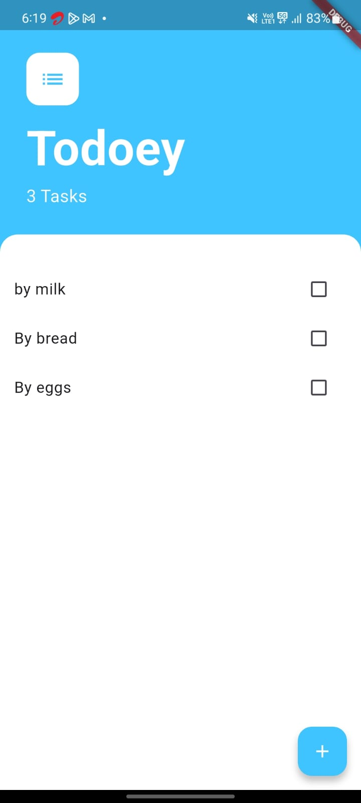
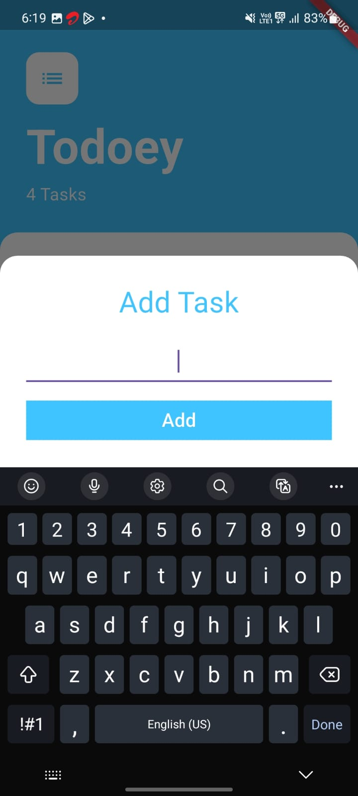

# 📝 Todoey App

A simple yet elegant to-do list app built using Flutter. Todoey lets you add, view, and manage your daily tasks with a clean UI and real-time state updates using `Provider`.

---

## 📱 Features

- ✅ **Add & Remove Tasks** – Create new tasks and mark them complete with a tap.
- 🔁 **State Lifting** – Data is passed efficiently between widgets using callbacks.
- ⚙️ **State Management** – Utilizes the `Provider` package for reactive state updates.
- 🧭 **Navigation** – Bottom sheet modal for seamless task entry.
- 🎨 **Clean UI** – Minimal and intuitive interface with a pleasant light blue theme.
- 🔔 **Real-time Updates** – Task list updates instantly when you add or modify tasks.

---
## 📸 Screenshots

 


---

## 🛠 Tech Stack

- **Flutter** – UI toolkit for building cross-platform apps.
- **Provider** – State management solution for maintaining and updating app state.
- **Dart** – Programming language for Flutter apps.

---

## 🚀 Getting Started

### Prerequisites

- Flutter SDK installed → [Install Flutter](https://flutter.dev/docs/get-started/install)
- Code editor (VSCode, Android Studio, etc.)

### Installation

1. Clone the repository:
   ```bash
   git clone https://github.com/yourusername/todoey_app.git
   cd todoey_app
